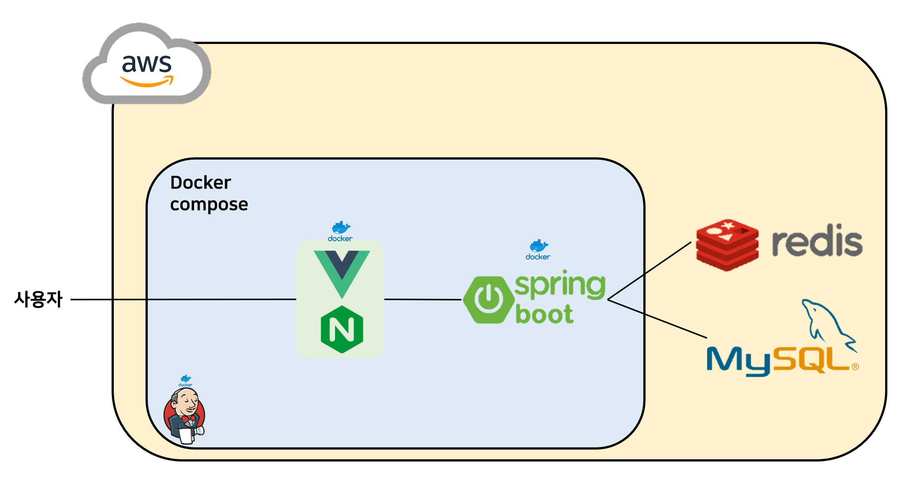

#  거미손
클라이밍계의 Solved.ac

<br>

## 목차
* [프로젝트 개요](#프로젝트-개요) 
* [프로젝트 소개](#프로젝트-소개) 
* [주요기능](#주요기능)
* [기술스택](#기술-스택)
* [배포방법](#배포-방법)
* [Conventions](#Conventions) 
* [역할](#역할) 
<br>

## 프로젝트 개요

### 진행 기간
> 2021.08.30 ~ 2021.10.08
### 목표
  - 각기 다른 클라이밍장의 레벨을 통합
  - 사용자의 실력을 우리만의 레벨로 표시 및 랭킹 확인
  - 문제 풀이 영상 확인

<br>

## 프로젝트 소개
**거미손**은 클라이밍장의 레벨 통합 및 사용자 랭킹을 제공해주는 서비스입니다.

### 클라이밍이란?
<!--  -->
<div style="text-align: center">
    
    <br/>
    <em>홀드</em>
    <br/> <br/>
    
    <br/>
    <em>레벨</em>
</div>
<br/>

- 홀드란?
    - 암벽을 등반하기 위해 발로 밟거나 손으로 잡는 돌 (검정 홀드)
    
- 레벨이란?
    - 색상 테이프를 이용해서 난이도를 표시 (핑크 레벨)

- 문제란?
    - 등반 시 사용할 수 있는 홀드의 집합 (검정 홀드 핑크 레벨 문제 등반 중)
    - 검은색 문제를 풀 때는 검은색 홀드만 사용가능

### 문제점
- 클라이밍장마다 난이도를 표시하는 색상의 종류, 순서가 달라서 난이도를 한 눈에 파악하기 어렵습니다.


> 출처: https://m.blog.naver.com/PostView.naver?isHttpsRedirect=true&blogId=pdongsoo&logNo=221907551709

<br>

### 기대효과

- **각기 다른 클라이밍장의 레벨을 통합**하고 우리만의 레벨로 표시함으로써 가보지 않은 클라이밍장의 난이도 쉽게 알 수 있습니다.
- **사용자의 실력을 우리만의 레벨로 표시**하고 **랭킹**을 확인할 수 있어 경쟁심을 유발하여 더욱 재미있게 다른 클라이머들과 클라이밍을 즐길 수 있습니다.
- 정답 영상을 손쉽게 찾을 수 있도록 다른 사람들의 클라이밍 **문제 풀이 영상 확인**이 가능합니다.

<br>

### 티어
- 거미손 서비스만의 레벨
- Bronze < Silver < Gold < Platinum < Diamond < Master

<div style="text-align: center">
    
</div>


<br>

## 주요기능

#### A 기능

#### B 기능

#### C 기능

<br>

## 기술 스택



### Front-end

- HTML5, CSS3, JS(ES6)
- Bootstrap4
- Vue.js 2.6.12, Vuex 3.5.1
- Visual Studio Code


### Back-end
- Java 1.8
- Spring Boot 2.5.4, Spring MVC, Spring Data JPA
- JPA, Hibernate, JPQL, QueryDSL
- Redis 6.2.5
- Gradle 7.1.1
- MySQL 8.0
- Intellij, Eclipse STS

### DevOps

- AWS EC2
- Nginx
- Jenkins

### Collaboration
- Jira
- Git, Gitlab, Sourcetree, GithubDesktop
- Mattermost
- [Notion](https://longing-tibia-c48.notion.site/A202-6593d6e894874c1d810a524f4c6b936d)

### 설치 및 실행

1. 깃 레포지토리 클론

   ```shell
   git clone [주소]
   ```

2. frontend 폴더로 이동 후 node_modules 설치

   ```shell
   npm i
   ```

3. 프론트의 [index.js](/frontend/src/constant/index.js)에서 백엔드 주소 변경

4. 백의 [application.yml](/backend/gumison/src/main/resources/application.yml)에서 spring.datasource.url 및 redis host 변경 

5. frontend backend/gumison에서 실행

   ```shell
   npm run serve
   ./gradlew clean bootJar
   ```

<br>

## 배포 방법

[배포문서](/exec/1-배포방법.md)

<br>

## Conventions

### Commit 규칙

``` 
feat: 커밋 제목

상세 내용
```

#### 종류
- feat: 기능 추가
- fix: 버그 수정
- docs: 문서 수정
- style: 코드 포맷, 세미 콜론 누락 (로직 변경 x)
- refactor: 리팩토링
- test: 테스트 코드
- chore: 빌드 업무 수정 패키지 매니저 수정 (로직 변경 x)
<br>

### 브랜치명 규칙

- master - develop - feature
- 개인 개발한 것들은 모두 feature/기능 브랜치에서 수행

<br>

```
feature/이슈번호-기능명
```


<br>

## 역할
#### 이현정(BE, FE)
* 사용자 검색
* 클라이밍장 검색
#### 김민기(BE, FE)
* 전체랭킹
* 특정 사용자 랭킹
* 경험치
* Redis
#### 김민지(BE, FE)
* 로그인
* 마이페이지
* JWT
#### 김용훈(BE, FE)
* 사용자 정보 조회
* 해결한 문제 목록 조회
* Jenkins
#### 손동우(BE, FE)
* 해결한 문제 등록
* 문제의 레벨 변경 기여
* Hadoop
---

Persona/Scenario: [Notion](https://longing-tibia-c48.notion.site/18e723784cc648f8bc3894a9e5d3ffe3)

Flowhart: [Miro](https://miro.com/app/board/o9J_ly4qOZ4=/)

Wireframe: [Figma](https://www.figma.com/file/7QfbLKcxcf6x6PcHOX3dDi/BigData?node-id=139%3A594)

기술명세서: [Google Sheet](https://docs.google.com/spreadsheets/d/139-gGMcWpDHfvwfkkuRc-e0uhv6dbrThx6peVbHDJ5g/edit#gid=57751177)

System Architecture: [Google Presentation](https://docs.google.com/presentation/d/1cWDYKZ30reb2djunNxHA0z655Wly9qsoL7yM0UUmuHk/edit#slide=id.gcb19888d7b_5_0)

DB ERD: [ERD Cloud](https://www.erdcloud.com/d/y6Fp3fQghb7LxwLeA)

API 명세서: [Google Sheet](https://docs.google.com/spreadsheets/d/1kWMIpE3GkuFl15K_j_j33c6FWiQ9tc_oHB5Cfs02G-g/edit#gid=0)

